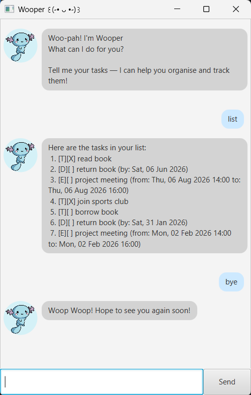

# Wooper User Guide



Wooper is a simple task management application that helps you keep track of your todos, deadlines, and events.
You can add tasks, mark them as done, update them, search for tasks, and more (all through simple text commands).

# Features

## Listing all tasks: `list`

Shows a list of all tasks.

**Format:**  
`list`

---

## Adding a ToDo: `todo`

Adds a ToDo task to Wooper.

**Format:**  
`todo DESCRIPTION`

**Examples:**
- `todo read book`
- `todo join sports club`

---

## Adding a Deadline: `deadline`

Adds a task with a due date.

**Format:**  
`deadline DESCRIPTION /by DD/MM/YYYY`  
or  
`deadline DESCRIPTION /by DD/MM/YYYY HH:MM`

**Examples:**
- `deadline return book /by 06/06/2026`
- `deadline submit report /by 06/06/2026 23:59`

---

## Adding an Event: `event`

Adds a task that occurs within a specific time period.

Both date-only and date+time formats are supported.

**Format:**  
`event DESCRIPTION /from DD/MM/YYYY /to DD/MM/YYYY`  
or  
`event DESCRIPTION /from DD/MM/YYYY HH:MM /to DD/MM/YYYY HH:MM`

**Examples:**
- `event project meeting /from 06/08/2026 /to 07/08/2026`
- `event project meeting /from 06/08/2026 14:00 /to 06/08/2026 16:00`

---

## Marking a task as done: `mark`

Marks the specified task as completed.

**Format:**  
`mark INDEX`

**Example:**
- `mark 1`

---

## Unmarking a task: `unmark`

Marks the specified task as not completed.

**Format:**  
`unmark INDEX`

**Example:**
- `unmark 1`

---

## Finding tasks: `find`

Shows tasks containing the given keyword.

**Format:**  
`find KEYWORD`

**Examples:**
- `find book`
- `find meeting`

---

## Updating a task: `update`

Updates the specified task.

**Format:**  
`update INDEX /taskType TYPE [FIELDS...]`

- `INDEX` refers to the task number shown in the list.
- `TYPE` must be one of: `todo`, `deadline`, `event`.

---

### Updating a ToDo

**Format:**  
`update INDEX /taskType todo /taskName NEW_NAME`

**Example:**
- `update 1 /taskType todo /taskName read more books`

---

### Updating a Deadline

You may update the task name, due date, or both.

**Formats:**
- `update INDEX /taskType deadline /taskName NEW_NAME`
- `update INDEX /taskType deadline /by DD/MM/YYYY`
- `update INDEX /taskType deadline /by DD/MM/YYYY HH:MM`
- `update INDEX /taskType deadline /taskName NEW_NAME /by DD/MM/YYYY`
- `update INDEX /taskType deadline /taskName NEW_NAME /by DD/MM/YYYY HH:MM`

**Examples:**
- `update 2 /taskType deadline /taskName return library book`
- `update 2 /taskType deadline /by 31/01/2026`
- `update 2 /taskType deadline /by 31/01/2026 23:59`
- `update 2 /taskType deadline /taskName submit report /by 15/02/2026`

---

### Updating an Event

You may update the task name, date range, or both.

**Formats:**
- `update INDEX /taskType event /taskName NEW_NAME`
- `update INDEX /taskType event /from DD/MM/YYYY /to DD/MM/YYYY`
- `update INDEX /taskType event /from DD/MM/YYYY HH:MM /to DD/MM/YYYY HH:MM`
- `update INDEX /taskType event /taskName NEW_NAME /from DD/MM/YYYY /to DD/MM/YYYY`
- `update INDEX /taskType event /taskName NEW_NAME /from DD/MM/YYYY HH:MM /to DD/MM/YYYY HH:MM`

**Examples:**
- `update 3 /taskType event /taskName team meeting`
- `update 3 /taskType event /from 10/02/2026 /to 11/02/2026`
- `update 3 /taskType event /from 10/02/2026 15:00 /to 10/02/2026 17:00`
- `update 3 /taskType event /taskName project discussion /from 10/02/2026 15:00 /to 10/02/2026 17:00`
---

## Deleting a task: `delete`

Deletes the specified task.

**Format:**  
`delete INDEX`

**Examples:**
- `delete 2`
- `delete 5`

---

## Exiting the program: `bye`

Exits Wooper.

**Format:**  
`bye`

After the `bye` command is entered, Wooper displays a farewell message and automatically closes the program.

# Sample Command Flow

Below is an example of a typical usage flow in Wooper.

---

## 1. Add tasks

```
todo read book
deadline return book /by 06/06/2026
event project meeting /from 06/08/2026 14:00 /to 06/08/2026 16:00
```

---

## 2. View all tasks

```
list
```

---

## 3. Mark a task as done

```
mark 1
```

---

## 4. Add another task

```
todo borrow book
```

---

## 5. Find tasks containing a keyword

```
find book
```

---

## 6. Update tasks

Update a ToDo:
```
update 1 /taskType todo /taskName read more books
```

Update a Deadline:
```
update 2 /taskType deadline /taskName return library book /by 31/01/2026
```

Update an Event:
```
update 3 /taskType event /taskName team meeting /from 10/08/2026 15:00 /to 10/08/2026 17:00
```

---

## 7. Exit the program

```
bye
```
